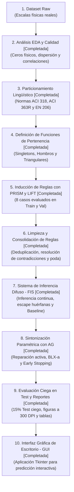

# Concrete Genetic Fuzzy

Sistema de Inteligencia Artificial para la predicción y análisis de la resistencia a la compresión del concreto (**Concrete Compressive Strength**), basado en **Lógica Difusa**, inducción modular de reglas mediante **PRISM con filtrado LIFT** y optimización paramétrica mediante **Algoritmos Genéticos (Fuzzy Tuning)**.

---

## 1. Arquitectura y Metodología del Proyecto


El flujo de trabajo general se estructura en las siguientes fases:



### Estado de las Fases del Proyecto:

1. **Fase 1: Análisis Exploratorio de Datos (EDA) y Calidad [Completada]**:
   * Caracterización estadística de las 8 variables de entrada y la variable objetivo.
   * Identificación de inflación de ceros estructurales (ausencia física de componentes).
   * Detección de duplicados, evaluación de outliers físicos y correlaciones lineales (Pearson) y monótonas (Spearman).
   * *Detalle completo:* [docs/01_analisis_eda.md](file:///home/gabriel/Desktop/Septimo/IA/concrete-genetic-fuzzy/docs/01_analisis_eda.md).

2. **Fase 2: Particionamiento y Etiquetado Lingüístico [Completada]**:
   * **Variables de entrada con 4 etiquetas (`No aplica`, `Poco`, `Medio`, `Alto`):**
     * `blast_furnace_slag` (45.73 % ceros).
     * `fly_ash` (54.95 % ceros).
     * `superplasticizer` (36.80 % ceros).
   * **Variable de entrada con 4 etiquetas temporales (`Muy Temprana`, `Estándar`, `Madura`, `Largo Plazo`):**
     * `age` ($CV = 138.3\%$, concentración en 28 días e hitos de curado).
   * **Variables de entrada con 3 etiquetas (`Poco`, `Medio`, `Alto`):**
     * `cement`, `water`, `coarse_aggregate`, `fine_aggregate` (componentes obligatorios sin ceros).
   * **Variable objetivo con 4 etiquetas (`Baja`, `Media-Baja`, `Media-Alta`, `Alta`):**
     * `compressive_strength` (fundamentada normativamente bajo ACI 318, ACI 363R y EN 206).

3. **Fase 3: Geometría de Funciones de Pertenencia y Fuzificación [Completada]**:
   * Modelado de conjuntos difusos mediante Singletons en cero (invariantes), Hombros Trapezoidales en los extremos y Triángulos en zonas intermedias satisfaciendo particiones de Ruspini ($\sum \mu_i = 1$).
   * Generación de la matriz difusa continua ($1005 \times 32$ columnas) y dataset discretizado.
   * *Detalle matemático y parámetros:* [docs/02_definicion_funciones_pertenencia.md](file:///home/gabriel/Desktop/Septimo/IA/concrete-genetic-fuzzy/docs/02_definicion_funciones_pertenencia.md).

4. **Fase 4: Inducción de Reglas con PRISM y Filtrado LIFT [Completada]**:
   * Particionamiento estratificado: 70% Train (703 muestras) / 15% Val (151 muestras) / 15% Test (151 muestras).
   * Evaluación de 8 escenarios experimentales variando soporte y confianza, exigiendo $\text{Lift} > 1.0$.
   * *Detalle completo:* [docs/03_induccion_reglas_prism_lift.md](file:///home/gabriel/Desktop/Septimo/IA/concrete-genetic-fuzzy/docs/03_induccion_reglas_prism_lift.md).

5. **Fase 5: Limpieza, Consolidación y Poda de Reglas [Completada]**:
   * Deduplicación exacta de reglas inducidas (reducción de 64 a 35 reglas únicas).
   * Detección y eliminación de 5 antecedentes contradictorios derivados del umbral permisivo del 25% de confianza.
   * Poda por calidad ($\text{Conf} \ge 50\%$, $\text{Supp} \ge 1\%$, $\text{Val Lift} > 1.0$) obteniendo **15 reglas consolidadas** robustas y con 0 contradicciones.
   * *Detalle completo:* [docs/04_limpieza_consolidacion_reglas.md](file:///home/gabriel/Desktop/Septimo/IA/concrete-genetic-fuzzy/docs/04_limpieza_consolidacion_reglas.md).

6. **Fase 6: Motor de Inferencia Difuso (FIS) y Evaluación Baseline [Completada]**:
   * Implementación del motor difuso continuo tipo Mamdani/TSK en [`src/fuzzy/inference.py`](file:///home/gabriel/Desktop/Septimo/IA/concrete-genetic-fuzzy/src/fuzzy/inference.py).
   * Mecanismo de escape para filas huérfanas ($y_{\text{default}} = 35.34\ MPa$) evitando división por cero y NaN.
   * Consecuentes parametrizables para las 4 clases de resistencia.
   * Evaluación de línea base inicial: Train RMSE = 12.37 MPa, Val RMSE = 13.25 MPa ($R^2 = 0.4359$).
   * *Detalle completo:* [docs/05_motor_inferencia_fis_baseline.md](file:///home/gabriel/Desktop/Septimo/IA/concrete-genetic-fuzzy/docs/05_motor_inferencia_fis_baseline.md).


7. **Fase 7: Sintonización Paramétrica con Algoritmo Genético (Fuzzy Tuning) [Completada]**:
   * Codificación de cromosoma real de 69 genes (65 vértices difusos + 4 centroides continuos $y_c^*$).
   * Operador de reparación activa (*Forward-Backward pass*) que garantiza orden $a \le b \le c \le d$, ancho mínimo ($\delta_{\min}$) y solapamiento lingüístico ($\delta_{\text{overlap}}$).
   * Cruce BLX-$\alpha$ ($\alpha=0.3$), mutación Gaussiana acotada ($\sigma=0.06$), selección por torneo ($k=3$), elitismo y Early Stopping sobre Validación (15%).
   * Reducción de Train RMSE de $12.37 \to \mathbf{9.06\ MPa}$ ($R^2 = 0.6971$) y Test RMSE ciego de $13.06 \to \mathbf{9.79\ MPa}$ ($R^2 = 0.6434$) con cobertura del $99.34\%$.
   * *Detalle completo:* [docs/06_algoritmo_genetico_tuning.md](file:///home/gabriel/Desktop/Septimo/IA/concrete-genetic-fuzzy/docs/06_algoritmo_genetico_tuning.md).

8. **Fase 8: Visualizaciones y Reporte Final [Completada]**:
   * Generación de 5 figuras técnicas en [`results/figures/`](file:///home/gabriel/Desktop/Septimo/IA/concrete-genetic-fuzzy/results/figures) a 300 DPI (`ga_convergence_curve.png`, `scatter_actual_vs_predicted_test.png` y comparativas de funciones de pertenencia para `age`, `cement` y `water`).
   * Validación del comportamiento cinético del concreto aprendido automáticamente por el AG sin perder la interpretabilidad física.
9. **Fase 9: Interfaz Gráfica de Escritorio (Desktop GUI) [Completada]**:
   * Aplicación nativa interactiva en Python (`Tkinter`) en [`app.py`](file:///home/gabriel/Desktop/Septimo/IA/concrete-genetic-fuzzy/app.py) y [`src/gui/app.py`](file:///home/gabriel/Desktop/Septimo/IA/concrete-genetic-fuzzy/src/gui/app.py).
   * Carga rápida de 4 mezclas predefinidas de ensayo, cálculo de relación agua/cementante ($a/mc$) y clasificación ACI 318 / EN 206.
   * Transparencia del 100%: desglose en tiempo real de reglas activadas ($w_k > 0$), consecuentes ($y_k^*$) y grados de pertenencia ($\mu$).

---

## 2. Estructura del Repositorio

```text
concrete-genetic-fuzzy/
├── data/
│   ├── raw/
│   │   ├── README.md               # Datos originales intactos
│   │   └── dataset.csv             # Dataset UCI (1030 filas, 9 columnas)
│   └── processed/
│       ├── dataset_clean.csv       # Dataset sin duplicados (1005 filas)
│       ├── fuzzy_matrix.csv        # Matriz difusa continua (1005 x 32 columnas en [0, 1])
│       ├── dataset_discretized.csv # Dataset con etiquetas lingüísticas (insumo de PRISM)
│       └── splits/                 # Particiones 70% Train / 15% Val / 15% Test
├── docs/
│   ├── README.md                   # Índice de documentación técnica
│   ├── 01_analisis_eda.md          # Informe técnico del análisis exploratorio
│   ├── 02_definicion_funciones_pertenencia.md # Arquitectura formal de conjuntos difusos
│   ├── 03_induccion_reglas_prism_lift.md # Inducción de reglas PRISM y métricas LIFT (8 casos)
│   ├── 04_limpieza_consolidacion_reglas.md # Fase 1: Deduplicación, contradicciones y poda
│   ├── 05_motor_inferencia_fis_baseline.md # Fase 6: Motor de inferencia difuso y baseline
│   ├── 06_algoritmo_genetico_tuning.md # Fase 7: Sintonización paramétrica con AG
│   └── 07_evaluacion_final_visualizaciones.md # Fase 8 / Paso 4: Evaluación ciega y reportes
├── results/
│   ├── figures/                    # 35 figuras generadas a 300 DPI (EDA, convergencia, pertenencias, dispersión)
│   └── tables/                     # 25 tablas de calidad, reglas PRISM, baseline, convergencia, evaluación y modelos
├── src/
│   ├── __init__.py                 # Paquete principal
│   ├── config.py                   # Centralización de rutas y nombres estándar
│   ├── data/                       # Carga, limpieza y particionamiento del dataset
│   │   ├── __init__.py
│   │   ├── __main__.py
│   │   ├── loader.py
│   │   └── splitter.py             # División estratificada 70/15/15
│   ├── eda/                        # Fase 1: Análisis Exploratorio de Datos
│   │   ├── __init__.py
│   │   ├── __main__.py
│   │   └── analysis.py
│   ├── fuzzy/                      # Fases 2, 3 y 6: Lógica Difusa e Inferencia
│   │   ├── __init__.py
│   │   ├── __main__.py
│   │   ├── membership.py           # Funciones de pertenencia (trapmf, trimf) y conjuntos
│   │   ├── fuzzifier.py            # Generación de matriz difusa y discretización
│   │   └── inference.py            # Motor de inferencia difuso y evaluación baseline
│   ├── rules/                      # Fases 4 y 5: Inducción y Limpieza de Reglas
│   │   ├── __init__.py
│   │   ├── __main__.py
│   │   ├── prism.py                # Algoritmo PRISM y evaluación de los 8 casos
│   │   └── cleaner.py              # Limpieza, deduplicación, poda y auditoría
│   ├── genetic/                    # Fase 7: Algoritmo Genético (Tuning)
│   │   ├── __init__.py
│   │   ├── __main__.py             # Entrypoint ejecutable
│   │   ├── chromosome.py           # Estructura y decodificación de los 69 genes
│   │   ├── operators.py            # Reparación activa, cruce BLX-a y mutación Gaussiana
│   │   ├── fitness.py              # Evaluación vectorizada de RMSE continuo
│   │   └── ga.py                   # Bucle evolutivo, elitismo y Early Stopping
│   ├── visualization/              # Reportes Gráficos y Visualizaciones
│   │   ├── __init__.py
│   │   ├── __main__.py             # Entrypoint ejecutable
│   │   └── plots.py                # Generador de figuras a 300 DPI
│   ├── evaluation/                 # Paso 4: Evaluación Ciega Final
│   │   ├── __init__.py
│   │   ├── __main__.py             # Entrypoint ejecutable
│   │   └── evaluate.py             # Auditoría formal y métricas en Test
│   └── gui/                        # Interfaz Gráfica de Escritorio (Tkinter)
│       ├── __init__.py
│       ├── __main__.py             # Entrypoint ejecutable
│       └── app.py                  # Aplicación de escritorio interactiva
├── app.py                          # Lanzador directo de la aplicación de escritorio
├── requirements.txt                # Dependencias del proyecto
└── README.md                       # Documentación principal del proyecto
```

---

## 3. Preparación del Entorno y Ejecución

### Requisitos previos
* Python 3.10+

### Instalación
```bash
python3 -m venv .venv
source .venv/bin/activate
python -m pip install --upgrade pip
pip install -r requirements.txt
```

### 1. Ejecutar el análisis exploratorio (EDA)
```bash
python -m src.eda
```

### 2. Ejecutar la Fuzificación y Discretización
```bash
python -m src.fuzzy
```

### 3. Ejecutar la División Estratificada (70% Train / 15% Val / 15% Test)
```bash
python -m src.data
```

### 4. Ejecutar la Inducción de Reglas con PRISM y Filtrado LIFT
```bash
python -m src.rules
```

Los resultados de las reglas para los 8 casos experimentales estandarizados (`rules_caso_#_conf#_supp#.csv`), la tabla consolidada `rules_cases_summary.csv` y el estudio de sensibilidad se guardan en `results/tables/`.

### 5. Ejecutar la Limpieza y Consolidación de Reglas (Fase 1: Filtro Manual / Lógico)
```bash
python -m src.rules.cleaner
```

Genera la base de reglas aprobada [`results/tables/rules_consolidated.csv`](file:///home/gabriel/Desktop/Septimo/IA/concrete-genetic-fuzzy/results/tables/rules_consolidated.csv) (15 reglas sin contradicciones, con confianza $\ge 50\%$, soporte $\ge 1\%$ y $\text{Val Lift} > 1.0$) y la auditoría completa [`results/tables/rules_cleaning_audit.csv`](file:///home/gabriel/Desktop/Septimo/IA/concrete-genetic-fuzzy/results/tables/rules_cleaning_audit.csv).


### 6. Ejecutar el Motor de Inferencia Difuso y Evaluación de Línea Base (Baseline)
```bash
python -m src.fuzzy.inference
```

Evalúa el modelo continuo en $MPa$ sobre Train, Val y Test con escape para filas huérfanas, exportando el resumen a [`results/tables/baseline_inference_summary.csv`](file:///home/gabriel/Desktop/Septimo/IA/concrete-genetic-fuzzy/results/tables/baseline_inference_summary.csv).

### 7. Ejecutar la Sintonización Paramétrica con Algoritmo Genético (Fuzzy Tuning)
```bash
python -m src.genetic
```

Ejecuta la optimización evolutiva con reparación activa y Early Stopping. Genera el historial generacional [`results/tables/ga_convergence_history.csv`](file:///home/gabriel/Desktop/Septimo/IA/concrete-genetic-fuzzy/results/tables/ga_convergence_history.csv), la tabla comparativa formal [`results/tables/ga_tuning_comparison.csv`](file:///home/gabriel/Desktop/Septimo/IA/concrete-genetic-fuzzy/results/tables/ga_tuning_comparison.csv) y el detalle de parámetros en [`results/tables/tuned_parameters_summary.csv`](file:///home/gabriel/Desktop/Septimo/IA/concrete-genetic-fuzzy/results/tables/tuned_parameters_summary.csv).

### 8. Generar las Figuras y Reportes Visuales Finales
```bash
python -m src.visualization
```

Genera en `results/figures/` la curva de convergencia generacional (`ga_convergence_curve.png`), el diagrama de dispersión en el conjunto ciego de prueba (`scatter_actual_vs_predicted_test.png`), las curvas de pertenencia antes vs. después del tuning para `age`, `cement` y `water`, y la cuadrícula completa de 8 variables (`fuzzy_membership_comparison_all_variables.png`).

### 9. Ejecutar la Evaluación Ciega Final (Test 15% - 151 Muestras)
```bash
python -m src.evaluation
```

Ejecuta la auditoría formal definitiva sobre el conjunto ciego de prueba, exportando la tabla comparativa [`results/tables/final_test_evaluation.csv`](file:///home/gabriel/Desktop/Septimo/IA/concrete-genetic-fuzzy/results/tables/final_test_evaluation.csv), el detalle muestra a muestra en [`results/tables/test_predictions_detailed.csv`](file:///home/gabriel/Desktop/Septimo/IA/concrete-genetic-fuzzy/results/tables/test_predictions_detailed.csv) y actualizando todos los reportes gráficos.

### 10. Iniciar la Interfaz Gráfica de Escritorio (Desktop GUI)
```bash
python app.py
# o también:
python -m src.gui
```

Abre la aplicación de escritorio en Python (`Tkinter`) para probar dosificaciones personalizadas de concreto en tiempo real:
* **Entrada de parámetros:** 8 componentes de la mezcla con sus rangos de ensayo típicos.
* **Casos rápidos (1-Click):** Botones para cargar mezclas predefinidas (*Hormigón Estándar 28d*, *Alta Resistencia HPC*, *Baja Resistencia Pobre*, *Desencofrado Rápido 3d*).
* **Predicción y Clasificación:** Lectura en $MPa$ con distintivo normativo según los estándares **ACI 318 / EN 206** y relación agua/material cementante ($a/mc$).
* **Transparencia y Explicabilidad Difusa:** Desglose interactivo de las reglas PRISM activadas ($w_k > 0$), su fuerza de disparo y las funciones de pertenencia evaluadas ($\mu$).

---

## 4. Documentación Técnica Vinculada

* [docs/01_analisis_eda.md](file:///home/gabriel/Desktop/Septimo/IA/concrete-genetic-fuzzy/docs/01_analisis_eda.md): Justificación estadística, no linealidad de la edad, presencia física de ceros y comportamiento agua/cemento.
* [docs/02_definicion_funciones_pertenencia.md](file:///home/gabriel/Desktop/Septimo/IA/concrete-genetic-fuzzy/docs/02_definicion_funciones_pertenencia.md): Tipos de funciones de pertenencia, tablas de parámetros iniciales, invariantes del GA y tamaño del cromosoma.
* [docs/03_induccion_reglas_prism_lift.md](file:///home/gabriel/Desktop/Septimo/IA/concrete-genetic-fuzzy/docs/03_induccion_reglas_prism_lift.md): Resultados detallados de PRISM para los 8 casos experimentales, fórmulas de Lift, selección de base de reglas y estudio de sensibilidad.
* [docs/04_limpieza_consolidacion_reglas.md](file:///home/gabriel/Desktop/Septimo/IA/concrete-genetic-fuzzy/docs/04_limpieza_consolidacion_reglas.md): Fase 1 de refinamiento de reglas: deduplicación exacta, resolución de 5 contradicciones lógicas, poda por umbrales de calidad y base consolidada.
* [docs/05_motor_inferencia_fis_baseline.md](file:///home/gabriel/Desktop/Septimo/IA/concrete-genetic-fuzzy/docs/05_motor_inferencia_fis_baseline.md): Fase 6: Motor de inferencia difuso (FIS) continuo, blindaje de filas huérfanas, parametrización de consecuentes y resultados de la línea base.
* [docs/06_algoritmo_genetico_tuning.md](file:///home/gabriel/Desktop/Septimo/IA/concrete-genetic-fuzzy/docs/06_algoritmo_genetico_tuning.md): Fase 7: Arquitectura del algoritmo genético, operador de reparación activa, BLX-$\alpha$, convergencia y comparación formal de resultados.
* [docs/07_evaluacion_final_visualizaciones.md](file:///home/gabriel/Desktop/Septimo/IA/concrete-genetic-fuzzy/docs/07_evaluacion_final_visualizaciones.md): Fase 8: Análisis final de convergencia, dispersión en prueba ciega (151 muestras) y validación de funciones de pertenencia adaptadas.


