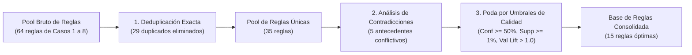

# Fase 1: Limpieza y Consolidación de Reglas (Filtro Manual / Lógico)

Este documento detalla el procedimiento de depuración, resolución de contradicciones y poda por calidad aplicado sobre el conjunto de reglas inducidas mediante el algoritmo **PRISM**, con el objetivo de estructurar una base de conocimiento robusta, compacta e interpretable para el **Sistema de Inferencia Difuso (FIS)**.

---

## 1. Motivación y Objetivos del Filtrado

Durante las pruebas experimentales previas (Casos 1 al 8) se variaron sistemáticamente los umbrales de **Confianza** (25%, 50%, 80%) y **Soporte** (25, 50, 80 muestras). Esta exploración permitió identificar el comportamiento del algoritmo PRISM, pero generó:
1. **Redundancias:** La misma regla lógica exacta descubierta repetidamente en distintos casos.
2. **Contradicciones lógicas:** Antecedentes genéricos idénticos asignados a respuestas opuestas (por ejemplo, el mismo insumo clasificado a la vez como resistencia *alta* y *media-alta*).
3. **Reglas ruidosas / Sobreajuste:** Reglas con confianza menor al 50% (cercanas al azar en un problema de 4 clases) o con degradación en validación ($\text{Val Lift} \le 1.0$).

Para solucionar esto, se aplicó la **Fase 1 de Limpieza y Consolidación**, estructurada en tres filtros formales:

---

## 2. Auditoría del Proceso de Depuración

### 2.1. Deduplicación de Reglas Idénticas
* **Reglas brutas extraídas:** 64 reglas.
* **Duplicados exactos eliminados:** 29 instancias (generadas repetidamente al relajar soportes o confianzas).
* **Reglas únicas iniciales:** 35 reglas.

### 2.2. Detección y Eliminación de Reglas Contradictorias
Se detectaron **5 antecedentes idénticos** que conducían a consecuentes opuestos o incompatibles:

| Antecedente | Consecuente 1 | Conf. Train | Lift Train | Consecuente 2 | Conf. Train | Lift Train | Origen | Diagnóstico |
|---|:---:|:---:|:---:|:---:|:---:|:---:|:---:|---|
| `IF age == 'largo_plazo'` | `alta` | 38.93 % | 1.90 | `media_alta` | 43.51 % | 1.57 | Casos 7 y 8 | Conflicto por falta de especificidad. |
| `IF age == 'madura'` | `alta` | 43.64 % | 2.13 | `media_alta` | 40.00 % | 1.44 | Casos 7 y 8 | Conflicto por falta de especificidad. |
| `IF fly_ash == 'alto'` | `baja` | 30.21 % | 1.44 | `media_baja` | 33.33 % | 1.08 | Casos 7 y 8 | Conflicto (además $\text{Val Lift} = 0.78$ en baja). |
| `IF superplasticizer == 'alto'` | `alta` | 38.04 % | 1.86 | `media_alta` | 28.83 % | 1.04 | Casos 7 y 8 | Conflicto por falta de especificidad. |
| `IF superplasticizer == 'medio'` | `alta` | 31.71 % | 1.55 | `media_alta` | 30.49 % | 1.10 | Casos 7 y 8 | Conflicto (además $\text{Val Lift} = 0.60$ en media-alta). |

> [!IMPORTANT]
> **Causa Raíz de las Contradicciones:**
> Todas las reglas contradictorias provinieron **exclusivamente de los Casos 7 y 8**, donde se fijó una confianza mínima del **25%**. Con un umbral tan permisivo, PRISM se detuvo tras seleccionar un único término antecedente, asignando la misma condición simple a dos clases distintas con niveles de confianza bajos (~28% a 43%), lo cual introduce ambigüedad inaceptable en un sistema difuso.

### 2.3. Criterios de Poda por Umbral de Calidad
1. **Confianza Mínima ($\ge 50.0\%$):** Elimina reglas ambiguas o ruidosas. En un espacio balanceado de 4 clases (donde la probabilidad base a priori es ~25%), una confianza $< 50\%$ tiene baja certeza predictiva.
2. **Soporte Mínimo del Consecuente ($\ge 1.0\%$ del Train $\approx 7$ muestras):** Previene el sobreajuste hacia combinaciones aisladas.
3. **Métrica de Generalización en Validación ($\text{Val Lift} > 1.0$):** Garantiza que la asociación descubierta en entrenamiento mantenga relevancia positiva en datos no observados.

**Resultado del filtrado:**
* **Reglas evaluadas:** 35
* **Reglas descartadas:** 20 (por contradicción lógica, confianza $< 50\%$ o $\text{Val Lift} \le 1.0$).
* **Reglas consolidadas aprobadas:** **15 reglas**.
* **Contradicciones en el conjunto final:** **0 (cero conflictos)**.

---

## 3. Base de Reglas Consolidada (`results/tables/rules_consolidated.csv`)

La base de conocimiento final consta de **15 reglas modulares**, con balance entre las 4 clases de resistencia y un rendimiento medio de **56.87 % de confianza en entrenamiento** y **51.09 % en validación**, con un **Lift medio de 2.40 (Train) y 2.13 (Val)**:

| # | Consecuente | Regla Lógica (IF ... THEN ...) | Train Supp | Train Conf | Train Lift | Val Conf | Val Lift |
|:---:|:---:|---|:---:|:---:|:---:|:---:|:---:|
| **1** | `alta` | $\text{IF water == 'poco' AND age == 'estandar' AND cement == 'alto' THEN strength == 'alta'}$ | 33 (4.69%) | **82.50 %** | **4.03** | **100.0 %** | **4.87** |
| **2** | `alta` | $\text{IF blast\_furnace\_slag == 'poco' AND age == 'largo\_plazo' THEN strength == 'alta'}$ | 18 (2.56%) | **64.29 %** | **3.14** | **60.00 %** | **2.92** |
| **3** | `alta` | $\text{IF age == 'largo\_plazo' AND fine\_aggregate == 'poco' THEN strength == 'alta'}$ | 28 (3.98%) | **63.64 %** | **3.11** | **50.00 %** | **2.44** |
| **4** | `alta` | $\text{IF superplasticizer == 'alto' AND fly\_ash == 'no\_aplica' THEN strength == 'alta'}$ | 36 (5.12%) | **59.02 %** | **2.88** | **42.86 %** | **2.09** |
| **5** | `alta` | $\text{IF cement == 'alto' AND age == 'largo\_plazo' THEN strength == 'alta'}$ | 26 (3.70%) | **54.17 %** | **2.64** | **35.71 %** | **1.74** |
| **6** | `alta` | $\text{IF cement == 'alto' AND age == 'estandar' AND fine\_aggregate == 'poco' THEN strength == 'alta'}$ | 24 (3.41%) | **50.00 %** | **2.44** | **42.86 %** | **2.09** |
| **7** | `baja` | $\text{IF fly\_ash == 'alto' AND blast\_furnace\_slag == 'no\_aplica' THEN strength == 'baja'}$ | 20 (2.84%) | **57.14 %** | **2.71** | **25.00 %** | **1.22** |
| **8** | `baja` | $\text{IF age == 'muy\_temprana' THEN strength == 'baja'}$ | 116 (16.5%) | **50.43 %** | **2.40** | **51.02 %** | **2.48** |
| **9** | `media_alta` | $\text{IF blast\_furnace\_slag == 'poco' AND cement == 'medio' THEN strength == 'media\_alta'}$ | 17 (2.42%) | **58.62 %** | **2.11** | **40.00 %** | **1.44** |
| **10** | `media_alta` | $\text{IF fine\_aggregate == 'poco' AND water == 'alto' AND age == 'largo\_plazo' THEN strength == 'media\_alta'}$ | 16 (2.28%) | **53.33 %** | **1.92** | **62.50 %** | **2.25** |
| **11** | `media_alta` | $\text{IF age == 'largo\_plazo' AND water == 'medio' THEN strength == 'media\_alta'}$ | 24 (3.41%) | **52.17 %** | **1.88** | **55.56 %** | **2.00** |
| **12** | `media_baja` | $\text{IF age == 'estandar' AND superplasticizer == 'no\_aplica' THEN strength == 'media\_baja'}$ | 41 (5.83%) | **55.41 %** | **1.80** | **43.75 %** | **1.41** |
| **13** | `media_baja` | $\text{IF fly\_ash == 'medio' AND age == 'estandar' THEN strength == 'media\_baja'}$ | 21 (2.99%) | **51.22 %** | **1.67** | **57.14 %** | **1.84** |
| **14** | `media_baja` | $\text{IF superplasticizer == 'poco' AND fly\_ash == 'alto' THEN strength == 'media\_baja'}$ | 22 (3.13%) | **51.16 %** | **1.67** | **66.67 %** | **2.14** |
| **15** | `media_baja` | $\text{IF coarse\_aggregate == 'medio' AND fine\_aggregate == 'medio' THEN strength == 'media\_baja'}$ | 15 (2.13%) | **50.00 %** | **1.63** | **33.33 %** | **1.07** |

---

## 4. Archivos Generados en la Fase 1

1. **[`results/tables/rules_consolidated.csv`](file:///home/gabriel/Desktop/Septimo/IA/concrete-genetic-fuzzy/results/tables/rules_consolidated.csv):**
   * Tabla final con las 15 reglas aprobadas, sus métricas y los archivos de procedencia.
2. **[`results/tables/rules_cleaning_audit.csv`](file:///home/gabriel/Desktop/Septimo/IA/concrete-genetic-fuzzy/results/tables/rules_cleaning_audit.csv):**
   * Auditoría completa de las 35 reglas únicas, especificando para cada una el estado (`CONSOLIDADA` o `DESCARTADA`), las causas detalladas de exclusión y la frecuencia de aparición en los experimentos.
3. **Módulo ejecutable ([`src/rules/cleaner.py`](file:///home/gabriel/Desktop/Septimo/IA/concrete-genetic-fuzzy/src/rules/cleaner.py)):**
   * Script automatizado que puede volver a ejecutarse mediante `python -m src.rules.cleaner`.

---

## 5. Próximo Paso: Fase 2 (Evaluación en el Motor de Inferencia Difuso)

Con las 15 reglas limpias y consistentes:
1. Se mapearán los antecedentes a las funciones de pertenencia correspondientes definidas en [docs/02_definicion_funciones_pertenencia.md](file:///home/gabriel/Desktop/Septimo/IA/concrete-genetic-fuzzy/docs/02_definicion_funciones_pertenencia.md).
2. Se construirá el motor de inferencia difuso tipo Mamdani con t-norma producto/mínimo y agregación por máximo.
3. Se procederá a la optimización de los parámetros difusos mediante el Algoritmo Genético (**Fuzzy Tuning**).
