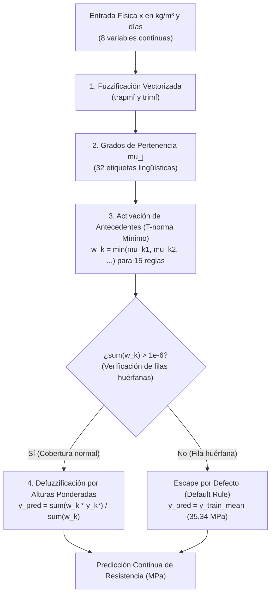

# Fase 6: Motor de Inferencia Difuso (FIS) y Evaluación de Línea Base (Baseline)

Este documento registra la arquitectura formal, implementación técnica y resultados de la **Línea Base (Baseline Inicial)** del **Motor de Inferencia Difuso (Fuzzy Inference System - FIS)** desarrollado en [`src/fuzzy/inference.py`](file:///home/gabriel/Desktop/Septimo/IA/concrete-genetic-fuzzy/src/fuzzy/inference.py).

---

## 1. Arquitectura del Motor de Inferencia Difuso

El sistema implementa un modelo difuso híbrido tipo **Mamdani / Takagi-Sugeno-Kang (TSK) de orden cero**, diseñado para predecir de forma cuantitativa y continua la resistencia a la compresión del concreto ($MPa$).

### Componentes Clave:
1. **Base de Reglas Activa:** 15 reglas inductivas consolidadas y libres de contradicciones ([`rules_consolidated.csv`](file:///home/gabriel/Desktop/Septimo/IA/concrete-genetic-fuzzy/results/tables/rules_consolidated.csv)).
2. **Operador T-norma:** Mínimo ($\min$) para conjunción lógica de antecedentes ($w_k = \min_j \mu_{A_{k,j}}(x_j)$).
3. **Defuzzificación Ponderada:**
   $$\hat{y}(x) = \frac{\sum_{k=1}^{15} w_k(x) \cdot y_k^*}{\sum_{k=1}^{15} w_k(x)}$$
   donde $y_k^*$ es el valor central continuo en $MPa$ correspondiente a la clase de la regla $k$.

---

## 2. Tratamiento de Filas Huérfanas (Soporte Incompleto)

El algoritmo PRISM induce reglas priorizando la pureza diagnóstica ($\text{Confianza} \ge 50\%$) y la fuerza de asociación ($\text{LIFT} > 1.0$), pero no impone que el 100% del espacio combinatorio multidimensional esté cubierto por alguna regla. 

En un dataset continuo, algunas combinaciones atípicas de componentes pueden producir grados de pertenencia nulos en todas las 15 reglas simultáneamente ($\sum w_k \le 10^{-6}$). Sin un mecanismo de escape, el denominador de la defuzzificación se anula, provocando `0 / 0 = NaN`.

### Diagnóstico de Cobertura en el Dataset:
* **Train (703 muestras):** 659 cubiertas (**93.74 %**), 44 huérfanas (6.26 %).
* **Val (151 muestras):** 140 cubiertas (**92.72 %**), 11 huérfanas (7.28 %).
* **Test (151 muestras):** 139 cubiertas (**92.05 %**), 12 huérfanas (7.95 %).

### Mecanismo de Escape Implementado:
$$\hat{y}(x) = \begin{cases} 
\dfrac{\sum_{k=1}^{15} w_k(x) \cdot y_k^*}{\sum_{k=1}^{15} w_k(x)}, & \text{si } \sum_{k=1}^{15} w_k(x) > 10^{-6} \\ 
y_{\text{default}} = \bar{y}_{\text{train}} = 35.34\ MPa, & \text{si } \sum_{k=1}^{15} w_k(x) \le 10^{-6} 
\end{cases}$$

Este mecanismo elimina por completo cualquier riesgo de `NaN` o división por cero durante la ejecución masiva de evaluaciones en el Algoritmo Genético.

---

## 3. Parametrización de Consecuentes ($y_k^*$)

Para no restringir al modelo a constantes fijas, los valores $y_k^*$ se desacoplan como parámetros configurables asignados a las 4 clases de resistencia:

| Consecuente | Rango Normativo (ACI 318 / EN 206) | Valor Inicial Baseline ($MPa$) | Rango de Sintonización para el GA ($MPa$) |
|---|:---:|:---:|:---:|
| `baja` | $< 20\ MPa$ | **13.90** | $[5.0, 20.0]$ |
| `media_baja` | $20 - 35\ MPa$ | **28.47** | $[20.0, 35.0]$ |
| `media_alta` | $35 - 50\ MPa$ | **41.02** | $[35.0, 50.0]$ |
| `alta` | $> 50\ MPa$ | **59.97** | $[50.0, 75.0]$ |

Los valores iniciales corresponden a las medias empíricas observadas en los datos de entrenamiento para cada estrato, lo que asegura un punto de partida físicamente calibrado.

---

## 4. Resultados de la Línea Base (Baseline Inicial Sin Optimizar)

Evaluación del sistema difuso inicial con las funciones de pertenencia nominales y las 15 reglas consolidadas ([`baseline_inference_summary.csv`](file:///home/gabriel/Desktop/Septimo/IA/concrete-genetic-fuzzy/results/tables/baseline_inference_summary.csv)):

| Partición | Muestras ($N$) | Filas Huérfanas | Tasa de Cobertura | RMSE ($MPa$) | MAE ($MPa$) | $R^2$ | MAPE (%) |
|---|:---:|:---:|:---:|:---:|:---:|:---:|:---:|
| **Train (70%)** | 703 | 44 | **93.74 %** | **12.37** | **9.17** | **0.4359** | 30.33 % |
| **Validación (15%)** | 151 | 11 | **92.72 %** | **13.25** | **10.10** | **0.2418** | 32.26 % |
| **Prueba (15%)** | 151 | 12 | **92.05 %** | **13.06** | **9.82** | **0.3649** | 30.52 % |

### Conclusiones de la Línea Base:
1. **Punto de Partida Sólido:** Sin haber ajustado un solo parámetro mediante optimización numérica, las 15 reglas explican el **43.59 % de la varianza ($R^2$) en Train**, con un error absoluto medio $\approx 9.17\ MPa$.
2. **Estabilidad General:** El RMSE en validación ($13.25\ MPa$) y prueba ($13.06\ MPa$) es coherente con el de entrenamiento ($12.37\ MPa$), evidenciando que la poda por calidad y la selección de reglas con $\text{LIFT} > 1.0$ previnieron eficazmente el sobreajuste.
3. **Objetivo para el Algoritmo Genético:** El tuning de funciones de pertenencia y centroides consecuentes en el **Paso 2** tendrá como meta reducir el RMSE en Train por debajo de los $8 - 10\ MPa$ y aumentar el $R^2$ por encima de $0.65 - 0.75$, conservando las restricciones de interpretabilidad y solapamiento.
